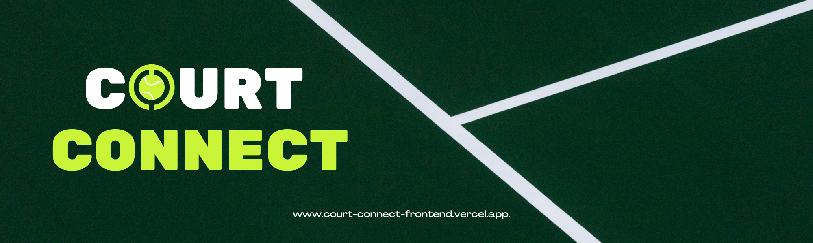
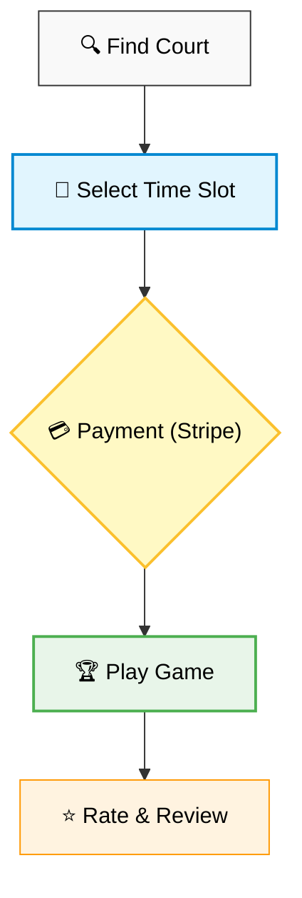

<div align="center">

  

  <br />
  <br />
  
  <p style="font-size: 1.5rem; font-style: italic; color: #fff;">
    "Connect with Sports Facilities, Book Courts Instantly"
  </p>

  <p>
    <a href="https://nextjs.org">
      
    </a>
    <a href="https://www.typescriptlang.org/">
      
    </a>
    <a href="https://tailwindcss.com/">
      
    </a>
    <a href="https://ui.shadcn.com/">
      
    </a>
  </p>

</div>

<br />

## 🚀 Overview

**Court Connect** is a cutting-edge full-stack platform designed to seamlessly connect sports enthusiasts with facility organizers. Built with the latest web technologies, it offers a robust ecosystem for browsing, scheduling, and managing court bookings.

Whether you want to play tennis, basketball, padel, or futsal, Court Connect provides the tools to find the perfect sports venue and secure your booking instantly with seamless payments.

---

## ✨ Outstanding Features

<table>
  <tr>
    <td width="50%" valign="top">
      <h3>🏃‍♂️ For Users</h3>
      <ul>
        <li><strong>Smart Discovery:</strong> Advanced search and filtering to find courts by sport, price, location, and availability.</li>
        <li><strong>Seamless Booking:</strong> Real-time calendar integration and Stripe payments for instant scheduling.</li>
        <li><strong>Interactive Dashboard:</strong> Track upcoming matches, booking history, and manage payments.</li>
        <li><strong>Review System:</strong> Rate facilities and leave feedback to help the sports community.</li>
      </ul>
    </td>
    <td width="50%" valign="top">
      <h3>🏟️ For Organizers</h3>
      <ul>
        <li><strong>Professional Profile:</strong> Showcase sports facilities, amenities, and high-quality photos.</li>
        <li><strong>Dynamic Availability:</strong> Set operational schedules and manage court time slots effortlessly.</li>
        <li><strong>Analytics & Earnings:</strong> Visualized data on booking performance and revenue (powered by Recharts).</li>
        <li><strong>Booking Management:</strong> Monitor reservations and confirm court availability with ease.</li>
      </ul>
    </td>
  </tr>
  <tr>
    <td colspan="2">
       <h3>🛡️ Admin & Platform</h3>
       <ul>
          <li><strong>Platform Moderation:</strong> Comprehensive tools to manage facilities, user activities, and maintain platform quality.</li>
          <li><strong>Category Management:</strong> CRUD operations for various sport categories and facility types.</li>
          <li><strong>Secure Authentication:</strong> Role-based access control (User, Organizer, Admin).</li>
       </ul>
    </td>
  </tr>
</table>

---

## 🤖 AI Assistant Feature (CourtBot)

CourtBot helps users find courts and get quick booking/payment help.

- Commands: `/help`, `/commands`, `/booking`, `/payment`, `/organizer`
- Example: "Find an indoor tennis court under $50"
- Example: "How do I book a court?"
- Smart behavior: fewer unnecessary AI calls, short replies, cleaner errors

---

## 🛠️ Tech Stack

<div align="center">

|                                                  Framework                                                  |                                                  Language                                                  |                                                      Styling                                                      |                                               Deployment                                               |
| :---------------------------------------------------------------------------------------------------------: | :--------------------------------------------------------------------------------------------------------: | :---------------------------------------------------------------------------------------------------------------: | :----------------------------------------------------------------------------------------------------: |
| <br/>**Next.js 16** | <br/>**TypeScript** | <br/>**Tailwind 4** | <br/>**Vercel** |

</div>

<br />

<br />

### **🧩 Key UI Libraries**

| Library                      | Purpose                                   |
| :--------------------------- | :---------------------------------------- |
| **Motion** (`framer-motion`) | Declarative animations and gestures       |
| **GSAP**                     | Advanced timeline-based animations        |
| **Lenis**                    | Smooth scrolling experience               |
| **Recharts**                 | Composable charting library               |
| **Lucide React**             | Beautiful & consistent icons              |
| **Stripe**                   | Secure payment processing                 |
| **React Hook Form + Zod**    | Form handling and schema validation       |
| **Shadcn UI**                | Accessible and customizable UI components |

---

## 🔄 User Booking Flow

The core experience of Court Connect revolves around a frictionless booking process:



---

## 📂 Project Structure

```bash
court-connect-frontend/
├── public/               # Static assets (images, icons, mock JSON)
├── src/
│   ├── actions/          # Server actions (Revalidation, API calls)
│   ├── app/              # Next.js App Router
│   │   ├── (auth)/       # Authentication routes (Login, Register)
│   │   ├── (dashboard)/  # Protected dashboard layouts (User, Organizer, Admin)
│   │   ├── (public)/     # Marketing pages (Home, Browse Courts)
│   │   └── api/          # Internal API routes
│   ├── components/
│   │   ├── features/     # Complex domain-specific components (Booking, Auth)
│   │   ├── ui/           # Reusable shadcn/ui primitives
│   │   └── shared/       # Global components (Header, Footer)
│   ├── config/           # Environment variables
│   ├── hooks/            # Custom React hooks
│   ├── lib/              # Utilities (API client, Stripe helpers)
│   ├── providers/        # Context providers (Theme, Lenis)
│   ├── service/          # API service layer
│   └── types/            # TypeScript definitions
├── next.config.ts        # Next.js configuration
└── package.json          # Dependencies
```

---

## ⚡ Getting Started

Follow these steps to set up the project locally.

### Prerequisites

- **Node.js:** v18 or higher
- **Package Manager:** pnpm (recommended), npm, or yarn

### Installation

1. **Clone the repository:**

   ```bash
   git clone https://github.com/your-username/court-connect-frontend.git
   cd court-connect-frontend
   ```

2. **Install dependencies:**

   ```bash
   pnpm install
   ```

3. **Set up environment variables:**
   Create a `.env.local` file in the root directory and add necessary variables (see `.env.example`).
   Make sure to include your Stripe publishable key and other relevant backend endpoints.

4. **Run the development server:**

   ```bash
   pnpm dev
   ```

5. **Open the app:**
   Visit `http://localhost:3000` in your browser.

---

<div align="center">
  <p>Made with ❤️ by <span style="color: #61dafb;">Sajid Khan</span></p>
</div>
